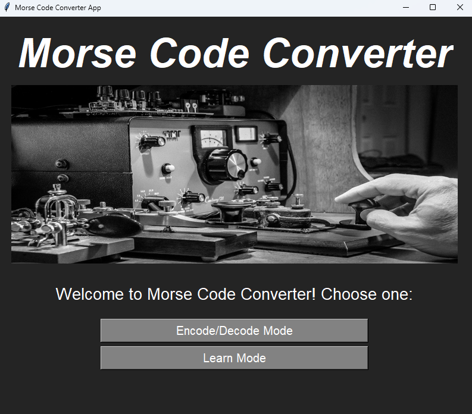
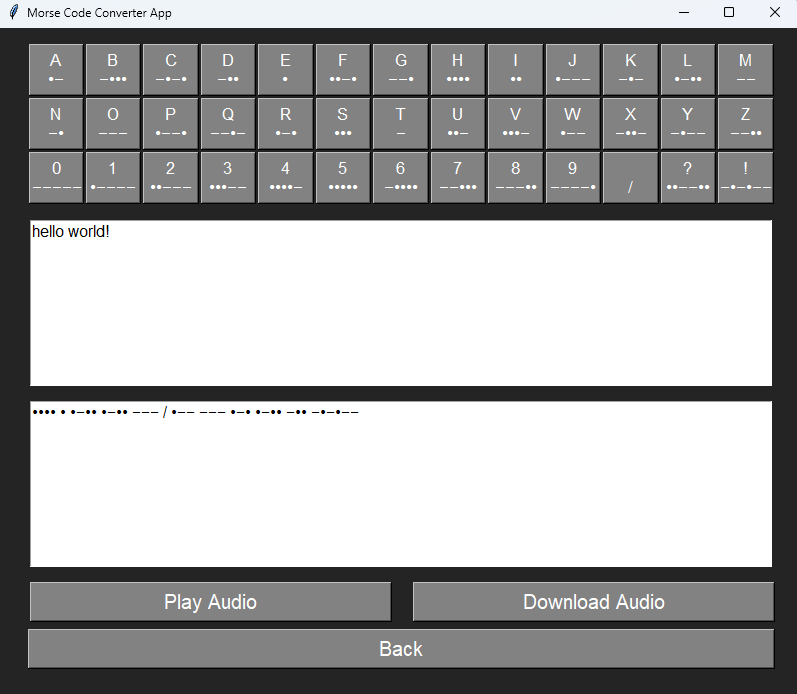
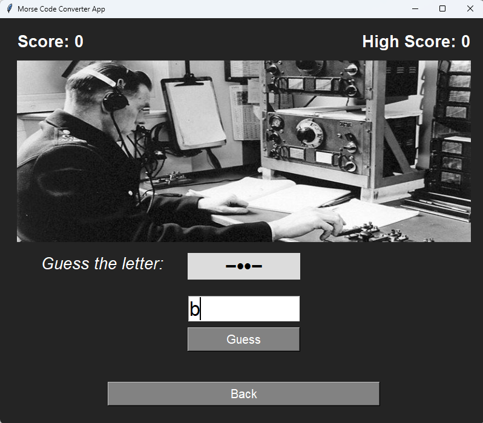

## Python Morse Code Converter 
Morse Code Converter is an interactive GUI application for encoding and decoding messages in Morse code. It supports real-time translation, audio playback and download, and a learning mode to help users memorize Morse code more effectively.

## App Features: 
🔹 Real-time translation – Convert text to Morse and Morse to text instantly.  
🔹 On-screen keyboard support – Easily input characters.  
🔹 Audio playback – Listen to Morse code.  
🔹 Download Morse audio – Generate and save Morse code audio files.  
🔹 Learning mode – Practice Morse code with quizzes.  
🔹 User-friendly interface – Clean design using Tkinter.  

## Application preview:

## Installation
1. Clone the repository  
   git clone https://github.com/your-username/morse-code-converter.git  
   cd morse-code-converter
   
2. Install required libraries  
   pip install -r requirements.txt
   
3. Run the application  
   python main.py

## Technologies Used  
🔹 Python – Main programming language  
🔹 Tkinter – GUI framework  
🔹 PIL (Pillow) – Image processing  
🔹 Wave & Pyaudio – Audio generation  
